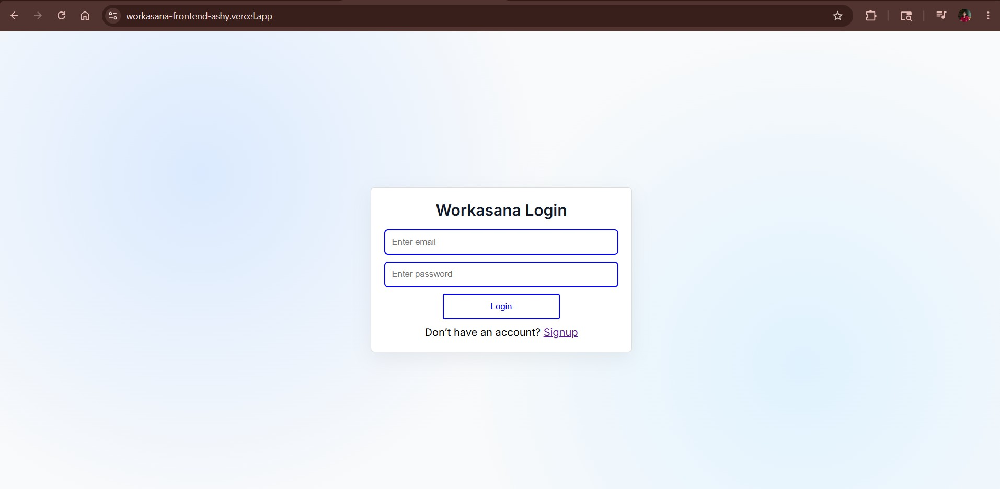
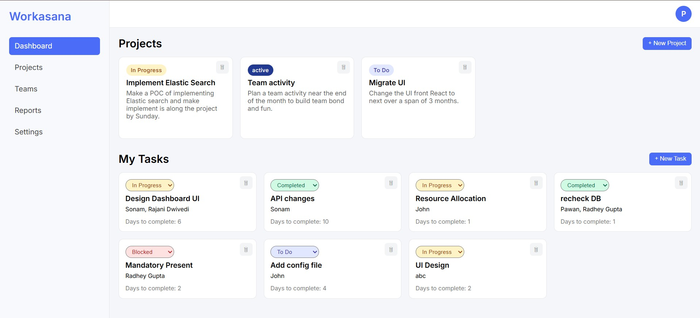
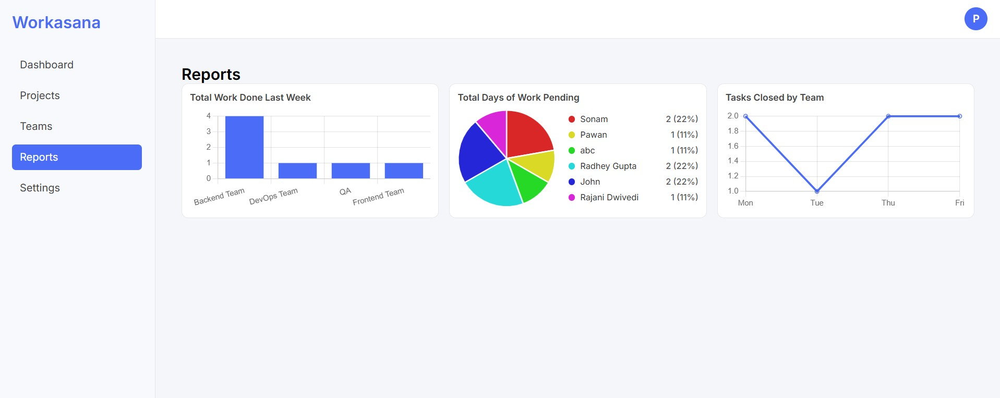
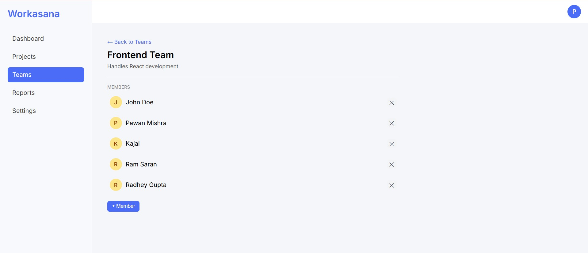

# WorkAsana - Work Management & Team Collaboration Platform

A full-stack project management and team collaboration platform that helps users create projects, manage tasks, assign responsibilities, and track workflow efficiently.

Built with a React frontend, Node.js/Express backend, MongoDB database, and secure authentication for seamless collaboration.

---

## Demo Link

[Live Demo](https://workasana-frontend-ashy.vercel.app/)

---

## Quick Start

```bash
git clone https://github.com/pawanx/WorkAsana-Frontend.git
cd WorkAsana-Frontend
npm install
npm run dev
```

---

## Technologies

- React JS
- React Router
- Node.js
- Express.js
- MongoDB
- JWT Authentication
- Bootstrap
- Axios
- Context API
- REST APIs

---

## Features

## Authentication

- Secure user registration and login
- JWT-based authentication
- Protected routes
- Persistent user sessions

---

## Dashboard

- Personalized workspace dashboard
- View project summaries and statistics
- Track task progress visually
- Quick access to active projects

---

## Project Management

- Create and manage multiple projects
- Organize projects by category
- View detailed project information
- Update project progress

---

## Task Management

- Create tasks within projects
- Assign tasks to team members
- Update task status
- Set deadlines and priorities

---

## Team Collaboration

- Assign tasks to specific users
- Monitor team activity
- Real-time task updates
- Collaborative workflow tracking

---

## Progress Tracking

- Track completed and pending tasks
- Visual workflow monitoring
- Project completion insights
- Task status categorization

---

## Responsive UI

- Mobile-friendly interface
- Clean and intuitive dashboard
- Smooth navigation experience
- Optimized for all devices

---

## Screenshots

## Login Page



---

## Dashboard



---

## Report 



---

## Team Management



---

## API References

### **POST /api/auth/register**

Register a new user

Sample Response:

```json
{
  "message": "User registered successfully",
  "token": "jwt_token"
}
```

---

### **POST /api/auth/login**

Authenticate existing user

Sample Response:

```json
{
  "message": "Login successful",
  "token": "jwt_token"
}
```

---

### **POST /api/projects**

Create a new project

Sample Response:

```json
{
  "_id": "507f1f77bcf86cd799439011",
  "title": "Website Redesign",
  "description": "Revamp company website",
  "status": "Active"
}
```

---

### **GET /api/projects**

Fetch all projects

Sample Response:

```json
[
  {
    "_id": "507f1f77bcf86cd799439011",
    "title": "Website Redesign",
    "description": "Revamp company website",
    "status": "Active"
  }
]
```

---

### **POST /api/tasks**

Create a new task

Sample Response:

```json
{
  "_id": "657f1f77bcf86cd799439011",
  "title": "Design Landing Page",
  "assignedTo": "John",
  "priority": "High",
  "status": "Pending"
}
```

---

### **PATCH /api/tasks/:taskId**

Update task status

Sample Response:

```json
{
  "success": true,
  "message": "Task updated successfully"
}
```

---

### **DELETE /api/tasks/:taskId**

Delete a task

Sample Response:

```json
{
  "success": true,
  "message": "Task deleted successfully"
}
```
---

### **POST /api/teams/**

Create a new team:

Sample response:

```json
{
    "success" : true,
    "message" : "Team created successfully.",
    "team" : {
        "name" : "Frontend",
        "description" : "Frontend team",
        "members" : ["34343232vdfvrev46sv44"],
        "createdBy" : ["324vsv33vdvdfvdfvsv4ae"]
    }
}

```

---
### **GET /api/teams/**

Fetch the teams:

Sample response:

```json

{
    "success" : true,
    "teams" : [
        {
             "name" : "Frontend",
        "description" : "Frontend team",
        "members" : ["34343232vdfvrev46sv44"],
        "createdBy" : ["324vsv33vdvdfvdfvsv4ae"]
        }
    ]
}

```
---

### **PATCH /api/teams/:id/remove-member**

Remove a member from the team:

Sample response:

```json

{
    "success" : true,
    "message" : "Member removed successfully"
}

```

---

## Project Architecture

### Frontend:
- React
- Routing
- State Management
- API Integration

### Backend:
- Express Server
- Authentication Middleware
- REST APIs

### Database:
- MongoDB Atlas

---

## Future Improvements

- Reminder for coming project deadlines.
- AI integration to explain report
---

## Contact

For bugs, collaboration, or feature requests:

📧 **Email:** pawanmishra196@gmail.com

🔗 **Portfolio:** https://portfolio-pawanx.vercel.app

💼 **LinkedIn:** https://www.linkedin.com/in/pawan-mishra-08b3b9133/